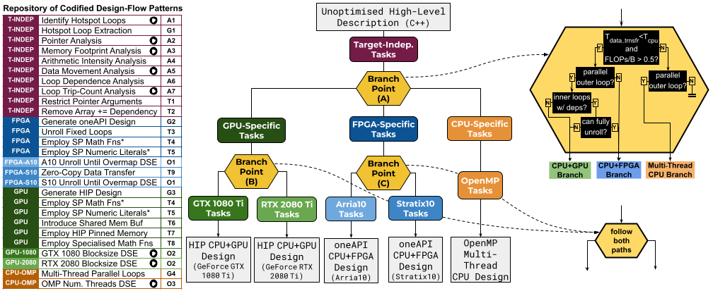

# automated-design-flows-with-psa

### Requirements
* Download and install Artisan (https://github.com/custom-computing-ic/artisan)
* Configure an Artisan Docker image with access to any/all of the following:
  * oneAPI tools (for CPU+FPGA design)
  * HIP tools (for CPU+GPU design)
  * OpenMP tools (for multi-thread CPU design)

### Repository Organisation
* `cpp_apps/` contains unoptimised, single-thread software code for 5 example applications:
  * `adpredictor/` - Bayesion advertisement click through rate predictor
  * `bezier-surface/` - Bezier surface generation
  * `kmeans/` - K-means classification
  * `nbody-sim/` - N-body simulation
  * `rush-larsen/` - Rush Larsen ODE solver
  * each of the above application folders has a `main.cpp` file containing the application logic, and a `meta_cl.make` file used as by Artisan meta-programs to compile and execute the code on various targets. To build and run each application as software, run `make cpu -f meta_cl.make` and `make run_cpu -f meta_cl.make`. 
* `design_flow.py` contains the DesignFlow class specification 
* `design_flow_patterns.py` contains all uniform, design-flow pattern implementations
* `normalisation.py` contains source-code normalisation meta-programs employed by DesignFlow objects
* `metaprograms.py` contains Artisan meta-programs emloyed as helpers by the implemented design-flow patterns
* `profilers.py` contains Artisan meta-program code for dynamic profilers used by the implemented design-flow patterns
* `oneapi.py`, `hip.py`, `openmp.py` contain framework-specific Artisan meta-programs used by the implemented design-flow patterns
* `util.py` contains utility functions used by the implemented Artisan meta-programs
* `my-design-flow.py` contains an example design-flow supporting multi-thread CPU, oneAPI CPU+FPGA, and HIP CPU+GPU design (described below)

### Run the Example Design-Flow

The example design-flow in `my-design-flow.py` is illustrated in the following figure.



To run the design-flow:
  * uncomment the name of the application you would like to target (lines 85-89)
  * run `artisan my-design-flow.py`

The resulting design(s) will be generated in a new folder, `gen/`, following the naming convention `{app-name}-{hip|oneapi|openmp}-{device}`. For example, a generated oneAPI CPU+FPGA design for AdPredictor targeting a Stratix10 platform will be output to `gen/adpredictor-oneapi-s10/`.

### Compose a Custom Design-Flow 

1. instantiate a top level DesignFlow object: `new_design_flow = DesignFlow('my-design-flow-name')`
2. add patterns: `new_design_flow.add_pattern(pattern-name, {'optional-param1': val, 'optional-param2': val, ...})`
   - see the below catalogue of implemented patterns for pattern names and optional parameters
3. add branch-points: `new_design_flow.add_branchpoint(decision_fn, [path1, path2])`
   - define a decision function as a regular python function that accepts two parameters: `ast` (representing the current application design) and `data` (a dictionary representing the current design-flow state), and returns a list of integer value(s) representing indices into the path list corresponding to the path(s) to take
   - for example:  
```
def decision_fn(ast, data):
    if suited_to_path1_only(ast):
        return [0]
    else:
        return [0,1]
```
4. define DesignFlow objects for each path: `path1 = DesignFlow('p1')`
   - each path is a self-contained DesignFlow, so patterns and branch points can be added as demonstrated in steps 2 and 3 (see `my_design_flow.py` for an example)
5. when you have described all design-flow paths and branch points, execute the design flow using the `run()` method: `new_design_flow.run(src, dest)`, where `src` is the path(s) to input C++ source files, and `dest` is the path to an output folder for generated designs. 


### Catalogue of Implemented Patterns:

`design_flow_patterns.py` contains implementations of the following patterns:

- `extract_hotspot(ast, data, filter_fn=outermost_filter, threshold=0.5, fn_name='__kernel__')`
   - purpose:
   - optional parameters:

- `loop_tripcount_analysis(ast, data, debug=False, exec_rule='')`
   - purpose:
   - optional parameters:
    
- `arithmetic_intensity_analysis(ast, data, exec_rule='')`
   - purpose:
   - optional parameters:
    
- `pointer_analysis(ast, data, *args)`
   - purpose:
   - optional parameters:
    
- `data_inout_analysis(ast, data, debug=False, exec_rule='')`
   - purpose:
   - optional parameters:
    
- `loop_dependence_analysis(ast, data, *args)`
   - purpose:
   - optional parameters:
    
- `generate_hip_design(ast, data, *args)`
   - purpose:
   - optional parameters:
    
- `employ_sp_fp_literals(ast, data, *args)`
   - purpose:
   - optional parameters:
    
- `employ_sp_math_fns(ast, data, *args)`
   - purpose:
   - optional parameters:
    
- `employ_reciprocal_math_fns(ast, data, *args)`
   - purpose:
   - optional parameters:
    
- `employ_hip_pinned_memory(ast, data, *args)`
   - purpose:
   - optional parameters:
    
- `hip_blocksize_timing_DSE(ast, data, device=None)`
   - purpose:
   - optional parameters:
    
- `multithread_parallel_loops(ast, data, *args)`
   - purpose:
   - optional parameters:
    
- `remove_compound_assignment_deps(ast, data, *args)`
   - purpose:
   - optional parameters:
    
- `omp_nthreads_DSE(ast, data, max_threads=32)`
   - purpose:
   - optional parameters:
    
- `generate_oneapi_design(ast, data, *args)`
   - purpose:
   - optional parameters:
    
- `use_oneapi_zerocopy_memory(ast, data, *args)`
   - purpose:
   - optional parameters:
    
- `unroll_small_fixed_bound_loops(ast, data, max_iters=20)`
   - purpose:
   - optional parameters:
    
- `introduce_shared_mem_buffers(ast, data, param=None, max_size=10000)`
   - purpose:
   - optional parameters:
    
- `unroll_until_fpga_overmap_DSE(ast, data, target='a10')`
   - purpose:
   - optional parameters:
    
