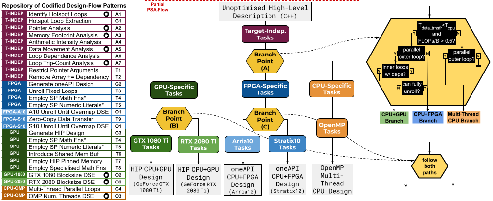

# automated-design-flows-with-psa

### Requirements
* Download and install Artisan (https://github.com/custom-computing-ic/artisan)
* Configure an Artisan Docker image with access to any/all of the following:
  * oneAPI tools (for CPU+FPGA design)
  * HIP tools (for CPU+GPU design)
  * OpenMP tools (for multi-thread CPU design)

### Repository Organisation
* `cpp_apps/` contains unoptimised, single-thread software code for 5 example applications:
  * `adpredictor/` - Bayesion advertisement click through rate predictor
  * `bezier-surface/` - Bezier surface generation
  * `kmeans/` - K-means classification
  * `nbody-sim/` - N-body simulation
  * `rush-larsen/` - Rush Larsen ODE solver
  * each of the above application folders has a `main.cpp` file containing the application logic, and a `meta_cl.make` file used as by Artisan meta-programs to compile and execute the code on various targets. To build and run each application as software, run `make cpu -f meta_cl.make` and `make run_cpu -f meta_cl.make`. 
* `design_flow.py` contains the DesignFlow class specification 
* `design_flow_patterns.py` contains all uniform, design-flow pattern implementations
* `normalisation.py` contains source-code normalisation meta-programs employed by DesignFlow objects
* `metaprograms.py` contains Artisan meta-programs emloyed as helpers by the implemented design-flow patterns
* `profilers.py` contains Artisan meta-program code for dynamic profilers used by the implemented design-flow patterns
* `oneapi.py`, `hip.py`, `openmp.py` contain framework-specific Artisan meta-programs used by the implemented design-flow patterns
* `util.py` contains utility functions used by the implemented Artisan meta-programs
* `my-design-flow.py` contains an example design-flow supporting multi-thread CPU, oneAPI CPU+FPGA, and HIP CPU+GPU design (described below)

### Run the Example Design-Flow

The example design-flow in `my-design-flow.py` is illustrated in the following figure.

To run the design-flow:
  * uncomment the name of the application you would like to target (lines 85-89)
  * run `artisan my-design-flow.py`

The resulting design(s) will be generated in a new folder, `gen/`, following the naming convention `{app-name}-{hip|oneapi|openmp}-{device}`. For example, a generated oneAPI CPU+FPGA design for AdPredictor targeting a Stratix10 platform will be output to `gen/adpredictor-oneapi-s10/`.

### Compose a Custom Design-Flow 

### Catalogue of Implemented Patterns:
