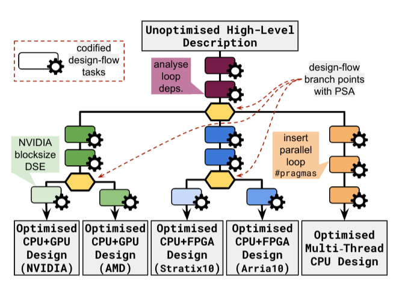

# Automated PSA-flows

### Contents
1. [Overview](#overview)
2. [Installation](#installation)
3. [Repository Organisation](#repository-organisation)
4. [PSA-Flow Description](#running-the-implemented-psa-flow)
5. [Composing Custom Design-Flows](#composing-custom-design-flows)
6. [Catalogue of Implemented Patterns](#catalogue-of-implemented-patterns)

### Overview

<p align="center">

</p>

This project demonstrates an innovative design-flow approach based on source-to-source transformations, which automatically derives optimized CPU (OpenMP), GPU (HIP), and FPGA (oneAPI) designs from complete unmodified C++ application source code. Leveraging meta-programming, we automate manual optimization tasks, including static code analysis, runtime behavior assessment, and code transformations, ensuring human-readable modifications. Building upon prior work, we introduce **PSA (Path-Selection Automation)-flows**, facilitating automated target selection via comprehensive static and dynamic analyses, thereby enhancing our capacity to conduct cost, energy, and performance experiments across diverse platforms while retaining full customization of our optimization and analysis techniques.

### Installation

Our PSA-flow framework is built on the foundations of Artisan (meta-programming), and our metaprograms work across different targets, including OpenMP, HIP and oneAPI. To replicate, tailor, or expand upon our work, we've curated a Docker image with these frameworks already installed and configured. 

To install our framework, follow these steps:

#### A. Requirements

* [Docker](https://docs.docker.com/engine/install/) with [non-root user management](https://docs.docker.com/engine/install/linux-postinstall/)
* At least 50GB space available to store the docker image

#### B. Procedure
1. Clone this repository to your preferred directory:
   ```bash
   git clone https://github.com/path/to/psa-flow.git /path/to/psa-flow
   ```
2. Add the bin/ directory to your system's PATH:
   ```bash
   export PATH="/path/to/psa-flow/bin:$PATH"
   ```
3. Download the Docker image (artisan:fpt23) from Docker Hub:
   ```bash
   artisan-pull
   ```

#### C. Usage

You can use the `artisan` script to work with the PSA-flows software. There are two modes of operation:

* **Shell Mode:** To run the software interactively, use the following command:
   ```bash
   artisan
   ```
   This command spawns a container, and the `/workspace` directory is mapped to your current host directory. You can execute Python scripts directly in this mode, and have access to all development frameworks used in this project (OpenMP, OneAPI and HIP).

* **Execution Mode (Recommended):** To execute a specific Python script, use the following command:
   ```bash
   artisan script.py
   ```

   This command runs `script.py` inside a spawned container. The examples below use this mode.


### Repository Organisation
* `cpp_apps/` contains unoptimised, single-thread software code for 5 example applications:
  * `adpredictor/` - Bayesion advertisement click through rate predictor [^1]
  * `bezier-surface/` - Bezier surface generation [^2]
  * `kmeans/` - K-means classification [^3]
  * `nbody-sim/` - N-body simulation [^3]
  * `rush-larsen/` - Rush Larsen ODE solver [^2]
  * each of the above application folders has a `main.cpp` file containing the application logic, and a `meta_cl.make` file used as by Artisan meta-programs to compile and execute the code on various targets. To build and run each application as software, run `make cpu -f meta_cl.make` and `make run_cpu -f meta_cl.make`.
* `design_flow.py` contains the DesignFlow class specification
* `design_flow_patterns.py` contains all uniform, design-flow pattern implementations
* `normalisation.py` contains source-code normalisation meta-programs employed by DesignFlow objects
* `metaprograms.py` contains Artisan meta-programs emloyed by the implemented design-flow patterns
* `profilers.py` contains Artisan meta-program code for dynamic profilers
* `oneapi.py`, `hip.py`, `openmp.py` contain framework-specific Artisan meta-programs
* `util.py` contains utility functions used by the implemented Artisan meta-programs
* `psa-flow.py` is an implemented design-flow supporting OpenMP multi-thread CPU, oneAPI CPU+FPGA, and HIP CPU+GPU design (described below)
* `partial-psa-flow.py` is a reduced version of the design-flow in `psa-flow.py` which can be executed without access to specialised hardware (described below)

[^2]: modified from https://github.com/zjin-lcf/HeCBench
[^3]: modified from https://github.com/maxeler/
[^1]: based on [this paper](https://www.microsoft.com/en-us/research/publication/web-scale-bayesian-click-through-rate-prediction-for-sponsored-search-advertising-in-microsofts-bing-search-engine/)

### PSA-Flow Implementation

The implemented PSA-flow in `psa-flow.py` is illustrated in the following figure.


**Overview**

This PSA-flow is able to generate OpenMP multi-thread CPU, HIP CPU+GPU, and oneAPI CPU+FPGA designs from arbitrary C++ source code inputs. Five target platforms are supported:
  * 2 CPU+GPU platforms with NVIDIA GeForce GTX 1080 Ti and RTX 1080 Ti GPUs
  * 2 CPU+FPGA platforms with Intel Arria10 and Stratix10 FPGAs
  * 1 32-core AMD CPU platform

The design-flow begins with a series of target-independent tasks, including dynamic applicaction hotspot detection/extraction and various application analyses.
At the first branch point, a target platform type is selected (multi-thread CPU, CPU+GPU, or CPU+FPGA). The decision can either be informed, using the built-in path selection strategy (depicted), or uninformed, selecting all paths to generate multiple diverse design implementations.
Within the CPU+GPU and CPU+FPGA paths, there are further branch points specialising for specific GPU or FPGA devices. These branch points are uninformed by default (i.e. they always generate both designs). In the device-specific paths, fine-grained device-specific DSE is performed.

All of the design-flow tasks listed in the repository on the left are implemented in `design_flow_patterns.py` (see catalogue below).

#### How to run the full PSA-flow to generate optimised designs:
  * `artisan psa-flow.py <app_name> <uninformed(optional)>`
      - app_name must be specified: `adpredictor`, `nbody-sim`, `bezier-surface`, `rush-larsen`, or `kmeans`
      - by default, the illustrated path selection strategy is plugged into branch point A, generating either *one* multi-thread CPU design, *two* CPU+FPGA designs (Arria10 and Stratix10), or *two* CPU+GPU designs (1080 Ti or 2080 Ti)
      - you can optionally specify `uninformed` to select all paths at branch point A and generate *five* designs (one for each target)
      - design(s) will be generated at the following path: `gen/{app-name}-{hip|oneapi|openmp}-{device}` (e.g. a generated oneAPI CPU+FPGA design for AdPredictor targeting a Stratix10 platform will be output to `gen/adpredictor-oneapi-s10/`)
      - *note: you need access to the two NVIDIA GPUs and/or Intel FPGA board support packages to generate GPU or FPGA designs (see the partial PSA-flow option below for an alternative)*

#### How to run a partial PSA-flow to generate baseline designs:
   * if you do not have access to the hardware required to run the complete PSA-flow, the partial version can be used to generate baseline designs for all three target types (OpenMP multi-thread CPU, HIP CPU+GPU, oneAPI CPU+FPGA)
   * this version does not run  device-specific optimising DSE (see the red box in the above figure)
   * `artisan partial-psa-flow.py <app_name> <target(optional)>`
      - app_name must be specified: `adpredictor`, `nbody-sim`, `bezier-surface`, `rush-larsen`, or `kmeans`
      - by default, the illustrated path selection strategy is plugged into branch point A, generating either a multi-thread CPU design, a CPU+FPGA design, or a CPU+GPU design
      - you can optionally specify a target: `cpu`, `fpga`, `gpu`, or `all`
      - resulting design(s) will be generated at the following path: `gen/{app-name}-{hip|oneapi|openmp}`

### Composing Custom Design-Flows

1. instantiate a top level DesignFlow object:

   `new_design_flow = DesignFlow('my-design-flow-name')`
3. add patterns:

   `new_design_flow.add_pattern(pattern-name, {'optional-param1': val, 'optional-param2': val, ...})`
   - see the below catalogue of implemented patterns for pattern names and optional parameters
5. add branch-points:

   `new_design_flow.add_branchpoint(decision_fn, [path1, path2])`
   - define a decision function as a regular python function that accepts two parameters: `ast` (representing the current application design) and `data` (a dictionary representing the current design-flow state), and returns a list of integer value(s) representing indices into the path list corresponding to the path(s) to take
   - for example:
```
def decision_fn(ast, data):
    if suited_to_path1_only(ast):
        return [0]
    else:
        return [0,1]
```
4. define DesignFlow objects for each path: `path1 = DesignFlow('p1')`
   - each path is a self-contained DesignFlow, so patterns and branch points can be added as demonstrated in steps 2 and 3 (see `my_design_flow.py` for an example)
5. when you have described all design-flow paths and branch points, execute the design flow using the `run()` method: `new_design_flow.run(src, dest)`, where `src` is the path(s) to input C++ source files, and `dest` is the path to an output folder for generated designs.


### Catalogue of Implemented Patterns

`design_flow_patterns.py` contains implementations of the following patterns:

- `extract_hotspot(ast, data, filter_fn=outermost_filter, threshold=0.5, fn_name='__kernel__')`
   - **purpose**: dynamically identified the most time consuming program loop and extracts it into an isolated function
   - **optional parameters**:
      - `filter_fn` specifies a filter to limit the loops profiled, by default we consider only outermost loops
      - `threshold` specified the minimum percentage of overall program execution time that a hotspot must comprise
      -  `fn_name` specifies the name of the newly created hotspot function

- `loop_tripcount_analysis(ast, data, debug=False, exec_rule='')`
   - **purpose**: dynamically determines the minimum, maximum, and average loopcount of each progrram loop, and statically verifies if they are fixed or not
   - **optional parameters**:
       - `exec_rule` specifies the target in the `meta_cl.make` file to use for execution (different targets use different input workload sizes)

- `arithmetic_intensity_analysis(ast, data, exec_rule='')`
   - **purpose**: dynamically determines a function's memory footprint and counts floating point operations to derive the arithmetic intensiity (FLOPs/B)
   - **optional parameters**:
       - `exec_rule` specifies the target in the `meta_cl.make` file to use for execution (different targets use different input workload sizes)

- `pointer_analysis(ast, data, *args)`
   - **purpose**: dynamically verifies if any pair of pointer arguments to a given function may alias (i.e. if the address ranges accessed overlap)
   - **optional parameters**:  n/a

- `data_inout_analysis(ast, data, debug=False, exec_rule='')`
   - **purpose**: dynamically quantifies the amount of data input and output to and from a certain function based on pointer arguments that are read from and/or written to
   - **optional parameters**:
       - `exec_rule` specifies the target in the `meta_cl.make` file to use for execution (different targets use different input workload sizes)

- `loop_dependence_analysis(ast, data, *args)`
   - **purpose**: statically determines if a loop contains loop-carried dependencies
   - **optional parameters**:  n/a

- `generate_hip_design(ast, data, *args)`
   - **purpose**: inserts boilerplate HIP GPU management code and transforms a specified function into a HIP GPU kernel with all necessry configuration and data transfer logic
   - **optional parameters**:  n/a

- `employ_sp_fp_literals(ast, data, *args)`
   - **purpose**: transforms all floating point literals to explicit single-precision versions (e.g. `1.0` --> `1.0f`)
   - **optional parameters**: n/a

- `employ_sp_math_fns(ast, data, *args)`
   - **purpose**: transforms library math function calls to explicit single-precision versions where available (e.g. `sqrt(x)` --> `sqrtf(x)`)
   - **optional parameters**: n/a

- `employ_reciprocal_math_fns(ast, data, *args)`
   - **purpose**: replaces expressions with equivalent built-in reciprocal math functions where available (e.g. `1/sqrt(x)` -->  `rsqrt(x)`)
   - **optional parameters**:  n/a

- `employ_hip_pinned_memory(ast, data, *args)`
   - **purpose**: transforms appropriate memory allocations to explicitly employ HIP page-locked memory (e.g. `malloc(...)` --> `hipHostMalloc(...)`)
   - **optional parameters**:  n/a

- `hip_blocksize_timing_DSE(ast, data, device=None)`
   - **purpose**: performs a dynamic, hill-climbing DSE to iteratively determine the blocksize that minimises execution time on a specific GPU target
   - **optional parameters**:
       -

- `multithread_parallel_loops(ast, data, *args)`
   - **purpose**: inserts require boilerplate OpenMP code and injects directives above parallel program loops indicating that they should be executed on multiple threads (e.g. `#pragma omp parallel for num_threads(N)`
   - **optional parameters**:  n/a

- `remove_compound_assignment_deps(ast, data, *args)`
   - **purpose**: introduces intermediate scalar variables to remove loop-carried dependencies associated with compound assignment operations on a pointer variable (e.g. `a[q].x += val` --> `T aqx = a[q].x ... aqx += val ... a[q].x = aqx]`)
   - **optional parameters**:  n/a

- `omp_nthreads_DSE(ast, data, max_threads=32)`
   - **purpose**: performs dynamic, hill-climbing DSE to iteratively determinie the number of threads that minimises execution time of a loop on a multi-thread CPU target
   - **optional parameters**:
       - `max_threads` specifies the maximum number of OpenMP threads to consider in the DSE

- `generate_oneapi_design(ast, data, *args)`
   - **purpose**: inserts boilerplate oneAPI FPGA management code and transforms a specified function into a oneAPI FPGA kernel with all necessry configuration and data transfer logic
   - **optional parameters**: n/a

- `use_oneapi_zerocopy_memory(ast, data, *args)`
   - **purpose**: transforms memory allocations and accesses to explicitly emploty oneAPI unified shared memory (USM) to implement kernels with zero copy data transfer (supported on Intel Stratix10 boards with support for USM)
   - **optional parameters**: n/a

- `unroll_small_fixed_bound_loops(ast, data, max_iters=20)`
   - **purpose**: inserts directives to explicitly unroll loops with know fixed bounds under a certain maximum trip count
   - **optional parameters**:
       - `max_iters` specifies the maximum fixed loop trip count to consider

- `introduce_shared_mem_buffers(ast, data, param=None, max_size=10000)`
   - **purpose**: creates a shared memory buffer inside a GPU or FPGA kernel for a read-only pointer that is smaller than a specified maximum size, inserts logic to copy the contents of a the pointer into the buffer, and replaces pointer accesses within the kernel to corresponding buffer accesses
   - **optional parameters**:
       - `param` specifies a certain variable for which to insert a shared memory buffer
       - `max_size` specifies the maximum size (B) of a read only pointer to consider for shared memory buffering

- `unroll_until_fpga_overmap_DSE(ast, data, target='a10')`
   - **purpose**: performs a hill-climbing DSE to iteratively determinie the maximum unroll factor for an outermost FPGA kernel loop that does not increase the initiation interval and does not overmap a target FPGA device based on estimated resource utilisation obtained by generating oneAPI high-level design reports at each iteration
   - **optional parameters**:
       - `target` specifies the specific FPGA device to optimise for

